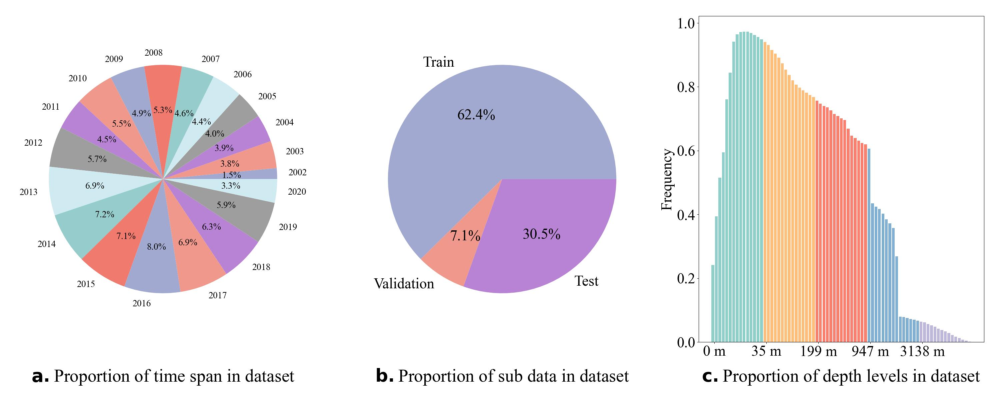

#### Abstract

Due to spatial sparsity and temporal discontinuity of observational oceanic DO databases, one of the most significant drawbacks of using data-driven methods is that the observation is too scarce to achieve proper training over a vast spatial-temporal scale. Indeed, the lack of oxygen observations in open-access international databases prevents a full quantitative evaluation of hypoxia severity on seasonal and interannual timeframes by wider research community. To greatly increase the number of training data, we integrated DO observational data from different data source to a more extensive database in combination with using rigorously depth mapping and strict quality control. DO dataset are then combined for data-driven modeling during 2002 to 2020 using observed DO concentration as the response variable and hydrometeorological / biogeochemical drivers as variables. We split the dataset into training, validation and test sets sequentially by sampling time. This means that, Oxyformer model was learned by the way of back-propagating update weights on DO dataset from 2002 to 2014. Early stopping, hyperparameter search were all done during the 2015 validation year. To further evaluate the accuracy of Oxyformer, the samples in the period of 2016 to 2020 were kept unused until the Oxyformer was finalized, thus testing Oxyformer’s representative capacity to generalize to unknown data.
  
#### Description

